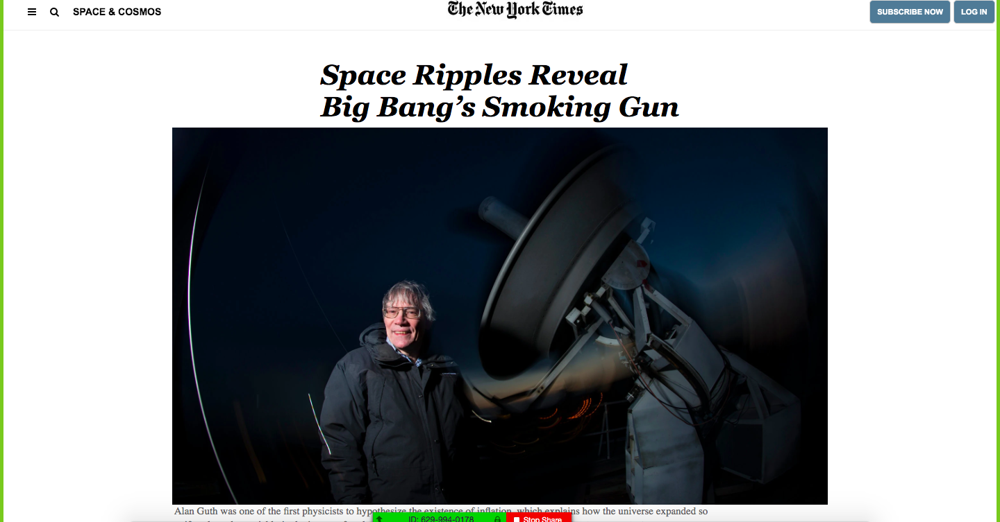

# NewYorkTimes-clone

> The assignment was to clone an article page of the New York Times using embedded images and videos, forms and buttons, float, flexbox, and grid. 

## Built With

- HTML and CSS,

## Live Demo

[Live Demo Link](https://brittanyblake.github.io/NewYorkTimes-clone/)

## Authors

👤 **Brittany Blake**

- Github: [@BrittanyBlake](https://github.com/BrittanyBlake)
- Twitter: [@bbcodes_](https://twitter.com/bbcodes_)
- Linkedin: [Brittany Blake](https://www.linkedin.com/in/brittany-blake-843951109/)

👤 **Maurice Murangwa**

- Github: [@Morrism1](https://github.com/Morrism1)
- Twitter: [@MorrisMontana0](https://twitter.com/MorrisMontana0)
- Linkedin: [Maurice Murangwa](https://www.linkedin.com/in/murangwa-maurice-769549140/)

## 🤝 Contributing

Contributions, issues and feature requests are welcome!

Feel free to check the [issues page](issues/).

## Show your support

Give a ⭐️ if you like this project!

## 📝 License

This project is [MIT](lic.url) licensed.
